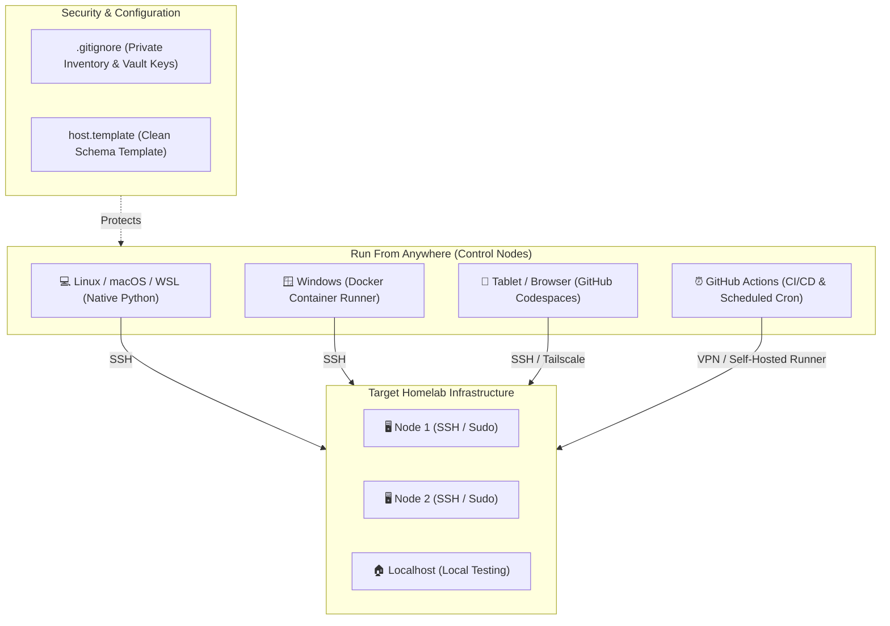

# AnsibleFromEverywhere 🚀

[](https://github.com/arvesv/AnsibleFromEverywhere/actions/workflows/ci.yml)


[](file:///home/arve/GitHub/AnsibleFromEverywhere/LICENSE)

> A reproducible, secure Ansible starter project engineered to run from **anywhere**: local Linux, macOS, WSL, Windows via Docker, cloud Dev Containers, GitHub Codespaces (even from a tablet), or automated GitHub Actions pipelines.

---

## Why AnsibleFromEverywhere?

I use Ansible for managing my homelab because of its simplicity and minimal requirements on managed nodes: it only requires standard **SSH** and an authorized user with proper rights on the target machines—no heavyweight agents needed.

However, the **control node** (where you run Ansible from) has requirements of its own:
- A Unix-like operating system (Linux or macOS)
- Python 3 with required libraries
- Ansible packages and Galaxy collections

I could install all this on a single desktop machine and call it a day, but I want true flexibility. **I want to run my homelab playbooks from anywhere:**

* 💻 **Linux / macOS / WSL**: Fast, native local execution for day-to-day work.
* 🪟 **Windows**: The Ansible control node cannot run natively on Windows, so running inside a Docker container solves this cleanly on Windows workstations without complex setups.
* 🐳 **Containers & Devspaces**: Keeps the host OS clean, ensures 100% reproducible environments, and avoids dependency conflicts.
* 📱 **GitHub Codespaces**: Traveling with just a tablet (iPad / Android) or Chromebook? Open a browser, launch GitHub Codespaces, and manage your homelab from anywhere in the world.
* ⏰ **Automated & Periodic Runs**: Run playbooks periodically via GitHub Actions (scheduled crons or drift checks) to enforce configurations and keep nodes updated.

---

## Architecture



---

## Run Environment Comparison

| Environment | Host Requirements | Setup Time | Best For |
| :--- | :--- | :--- | :--- |
| **Linux / macOS / WSL** | Python 3.10+, `make` | ~1 min | Primary workstation, local dev & testing |
| **Windows (Docker)** | Docker Desktop | ~2 min | Windows users who want zero WSL dependency |
| **Dev Containers** | VS Code + Docker | 1 click | Isolated local development with full IDE support |
| **GitHub Codespaces** | Web browser / tablet | 1 click | Remote management, traveling with iPad/laptop |
| **GitHub Actions** | GitHub Account | Automated | CI/CD, syntax checking, periodic drift audits |

---

## Quick Start (60 Seconds)

### 1. Clone the Repository
```bash
git clone https://github.com/arvesv/AnsibleFromEverywhere.git
cd AnsibleFromEverywhere
```

### 2. Set Up Environment & Inventory
```bash
# Creates virtualenv, installs pip dependencies, and downloads Ansible collections
make setup

# Or manually initialize your inventory from the template:
make init-inventory
```

### 3. Customize Your Inventory
Edit [`inventory/hosts.yml`](file:///home/arve/GitHub/AnsibleFromEverywhere/inventory/hosts.yml) with your homelab server IPs and usernames.
*(This file is ignored by Git to protect your private network credentials).*

### 4. Run the Hello World Playbook
```bash
make hello
# Or directly:
ansible-playbook playbooks/hello-world.yml
```

---

## Running from Anywhere

### 1. 💻 Local Machine (Linux, macOS, WSL)

If you have Python 3.10+ installed:

```bash
# Automated setup (venv + dependencies + collections)
make setup

# Lint playbooks and roles
make lint

# Run syntax check
make syntax

# Execute playbooks
make hello
make site
```

---

### 2. 🪟 Windows (Standalone Docker Runner)

No Python or Ansible installation required on Windows:

```powershell
# Build the Docker image
docker build -t ansible-from-everywhere:latest .

# Run the hello-world playbook
docker run --rm -v ${PWD}:/workspace ansible-from-everywhere:latest playbooks/hello-world.yml

# Or using Docker Compose:
docker compose run --rm ansible playbooks/hello-world.yml

# Run against your homelab passing your SSH key:
docker run --rm `
  -v ${PWD}:/workspace `
  -v ${HOME}/.ssh:/home/ansible/.ssh:ro `
  ansible-from-everywhere:latest site.yml
```

---

### 3. 📱 GitHub Codespaces (Browser / Tablet Friendly)

Manage your homelab from an iPad, Android tablet, Chromebook, or any browser:

1. Click **Code** -> **Codespaces** -> **Create codespace on everywhere** on GitHub.
2. The devcontainer builds automatically using [`.devcontainer/devcontainer.json`](file:///home/arve/GitHub/AnsibleFromEverywhere/.devcontainer/devcontainer.json):
   - Pre-installs Python 3.12, OpenSSH, Git, `rsync`, and `sshpass`.
   - Pre-installs Ansible collections and python requirements.
   - Activates the official **Red Hat Ansible** VS Code extension with syntax validation.
3. Open the built-in terminal and run:
   ```bash
   ansible-playbook playbooks/hello-world.yml
   ```

> [!TIP]
> **Connecting from Codespaces to Homelab**:
> To reach private homelab nodes from Codespaces or cloud runners, connect via **Tailscale**, **WireGuard**, or an SSH jump host/bastion.

---

### 4. 🐳 VS Code Dev Containers

For fully containerized local development inside VS Code:

1. Install the **Dev Containers** extension in VS Code.
2. Press `F1` and select **Dev Containers: Reopen in Container**.
3. All dependencies, linters, and extensions load automatically inside the container.
4. Your host SSH agent (`SSH_AUTH_SOCK`) is forwarded automatically for seamless SSH key authentication.

---

### 5. ⏰ GitHub Actions CI/CD & Periodic Automation

The included workflow [`.github/workflows/ci.yml`](file:///home/arve/GitHub/AnsibleFromEverywhere/.github/workflows/ci.yml) automatically runs on push, pull request, or manual trigger:
- **Linting**: Enforces quality standards with `ansible-lint`.
- **Syntax Check**: Validates playbook syntax for `playbooks/hello-world.yml` and `site.yml`.
- **Smoke Test**: Executes `playbooks/hello-world.yml` against localhost.

#### Periodic Drift Detection (Cron)
To run playbooks periodically (e.g. weekly updates or configuration drift checks), add a `schedule` trigger to your workflow:

```yaml
on:
  schedule:
    - cron: '0 3 * * 0' # Every Sunday at 03:00 UTC
  workflow_dispatch:
```

#### Secrets Configuration for Remote Homelab Runs
Store sensitive credentials in **GitHub Repository Secrets**:
- `SSH_PRIVATE_KEY`: Your deployment private SSH key.
- `ANSIBLE_VAULT_PASSWORD`: Vault password for decrypting secret variables.
- `TAILSCALE_AUTHKEY`: Ephemeral Tailscale auth key (if routing via Tailscale).

---

## Inventory & Secret Management

### Inventory Template
The repository includes [`inventory/hosts.yml.template`](file:///home/arve/GitHub/AnsibleFromEverywhere/inventory/hosts.yml.template) as a starting blueprint:

```yaml
---
all:
  children:
    homelab:
      hosts:
        node1.homelab:
          ansible_host: 192.168.1.10
          ansible_user: ansible
        node2.homelab:
          ansible_host: 192.168.1.11
          ansible_user: ansible
    local:
      hosts:
        localhost:
          ansible_connection: local
```

Copy it to your active inventory file:
```bash
cp inventory/hosts.yml.template inventory/hosts.yml
```

### Keeping Secrets Safe with Ansible Vault
Sensitive variables (passwords, tokens, private keys) should never be stored in plaintext. Use **Ansible Vault**:

```bash
# Encrypt a single sensitive variable:
ansible-vault encrypt_string 'my_super_secret_password' --name 'homelab_password'

# Create an encrypted variable file:
ansible-vault create group_vars/homelab/vault.yml

# Edit an existing encrypted file:
ansible-vault edit group_vars/homelab/vault.yml
```

[`.gitignore`](file:///home/arve/GitHub/AnsibleFromEverywhere/.gitignore) is pre-configured to exclude:
- Real inventory files (`inventory/hosts.yml`, `hosts`, `hosts.yml`)
- Vault password files (`.vault_pass*`, `*.vault_password`, `vault_pass.txt`)
- Retry files (`*.retry`) and Ansible log files

---

## Project Structure

```text
AnsibleFromEverywhere/
├── .devcontainer/           # VS Code Dev Container & Codespaces configuration
│   └── devcontainer.json
├── .github/
│   ├── workflows/
│   │   └── ci.yml          # GitHub Actions CI (linting & smoke tests)
│   └── dependabot.yml      # Automated dependency updates (Actions, Pip, Docker, Devcontainer)
├── collections/             # Downloaded Ansible collections (gitignored)
├── group_vars/              # Variables grouped by host categories
│   └── all.yml
├── inventory/
│   ├── hosts.yml           # Active inventory (gitignored, created from template)
│   └── hosts.yml.template  # Safe blueprint template for host definitions
├── playbooks/               # Playbooks directory
│   ├── hello-world.yml     # Minimal smoke test playbook
│   └── hello_world.yml     # Symlink to hello-world.yml
├── roles/                   # Reusable Ansible roles
│   └── common/             # Baseline system configuration role
├── ansible.cfg              # Ansible defaults (modern callback formatting, privilege escalation)
├── compose.yaml             # Docker Compose runner definition
├── Dockerfile               # Standalone containerized runner image
├── hosts.yml.template       # Symlink to inventory/hosts.yml.template
├── Makefile                 # Automation shortcuts (setup, lint, test, docker)
├── requirements.txt         # Python dependencies (ansible-core, ansible-lint)
├── requirements.yml         # Galaxy collections (community.general, ansible.posix)
└── site.yml                 # Master homelab baseline playbook
```

---

## Useful Commands Cheat Sheet

| Task | Make Shortcut | Native Command |
| :--- | :--- | :--- |
| **Show help** | `make help` | — |
| **Full setup** | `make setup` | Create venv + install pip + install galaxy |
| **Init inventory** | `make init-inventory` | `cp inventory/hosts.yml.template inventory/hosts.yml` |
| **Run linter** | `make lint` | `ansible-lint` |
| **Syntax check** | `make syntax` | `ansible-playbook --syntax-check ...` |
| **Smoke test** | `make hello` | `ansible-playbook playbooks/hello-world.yml` |
| **Run site setup** | `make site` | `ansible-playbook site.yml` |
| **Build Docker runner** | `make docker-build` | `docker build -t ansible-from-everywhere .` |
| **Run in Docker** | `make docker-hello` | `docker run --rm ... playbooks/hello-world.yml` |
| **Clean temp files** | `make clean` | `rm -rf .ansible/ *.retry ansible.log` |

---

## Contributing & Development

1. Fork and clone the repository.
2. Run `make setup` to configure your environment.
3. Ensure all changes pass linting before submitting a PR:
   ```bash
   make lint
   make syntax
   ```

---

## License

Distributed under the **Apache 2.0 License**. See [LICENSE](file:///home/arve/GitHub/AnsibleFromEverywhere/LICENSE) for full details.
